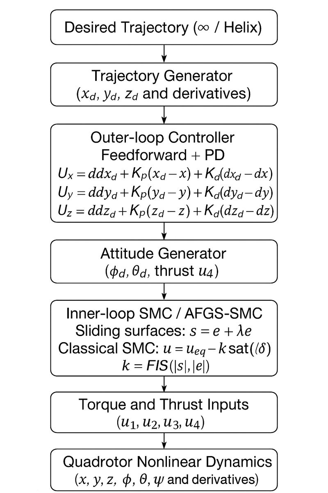

# Quadrotor Trajectory Tracking using Sliding Mode Control and Adaptive Fuzzy Gain Scheduling

## **Abstract**

This project presents a complete MATLAB framework for **nonlinear quadrotor UAV trajectory tracking**, comparing two robust control strategies:

- **Classical Sliding Mode Control (SMC)**
- **Adaptive Fuzzy Gain-Scheduled Sliding Mode Control (AFGS-SMC)**

A full 6-DOF quadrotor model is implemented using the Newton–Euler formalism, capturing nonlinear coupling between translational and rotational dynamics, gyroscopic effects, and underactuation. The controllers are evaluated on two demanding 3D trajectories:

- a **figure-8 (∞) trajectory**
- a **helical (spiral) trajectory**

Simulations are executed **with and without external disturbances** to analyze robustness, tracking precision, and control smoothness.  
The AFGS-SMC controller adaptively adjusts the SMC switching gain using a **Sugeno-type Fuzzy Inference System**, significantly reducing chattering while maintaining robustness.  
This repository provides a clean, modular, and reproducible implementation suitable for UAV trajectory tracking research, nonlinear control studies, and educational demonstrations.

---

## 🚁 **1. System Overview**

### **Quadrotor Dynamics**

The quadrotor is an **underactuated nonlinear system** with 6 states but only 4 control inputs:

- **States:**  
  $ x, y, z, \phi, \theta, \psi, \dot{x}, \dot{y}, \dot{z}, \dot{\phi}, \dot{\theta}, \dot{\psi} $

- **Control inputs (motor-generated):**
  - \( u_4 \): Total thrust  
  - \( u_1, u_2, u_3 \): Roll, pitch, yaw control torques  

The translational dynamics follow Newton's law:

$$
m\ddot{\mathbf{p}} = R(\phi,\theta,\psi) 
\begin{bmatrix}
0 \\ 0 \\ u_4
\end{bmatrix}
- 
\begin{bmatrix}
0 \\ 0 \\ mg
\end{bmatrix}
$$

The rotational dynamics use Euler angle equations:

$$
I\dot{\boldsymbol{\omega}} = -\boldsymbol{\omega} \times I\boldsymbol{\omega} + \mathbf{u}_{123}
$$

These nonlinear couplings make control challenging, especially during aggressive motion.

---

## ⚙️ **2. Sliding Mode Control (SMC)**

Sliding Mode Control is chosen because of its:

- robustness against disturbances  
- finite-time convergence  
- invariance to modeling errors  

### **Sliding Surface**

For an attitude angle $ q \in \{\phi, \theta, \psi\} $:

$$
s_q = \dot{e}_q + \lambda e_q
$$  

where:

- $ e_q = q - q_d $ is the tracking error  
- $ \lambda > 0 $ shapes the convergence rate  

### **SMC Control Law**

$$
u = u_{\text{eq}} - k \cdot \text{sat}\left(\frac{s}{\delta}\right)
$$

Where:

- $ u_{\text{eq}} $: equivalent control  
- $ k $: switching gain (fixed in classical SMC)  
- $ \delta $: boundary layer  
- $ \text{sat}(\cdot) $: smooth saturation to reduce chattering  

### **SMC Advantages**

- Highly robust  
- Guarantees convergence  
- Handles uncertainties  

### **SMC Limitations**

- Requires a large switching gain  
- Causes **chattering**, damaging motors  
- Not smooth near the sliding surface  

To overcome these issues, we introduce AFGS.

---

## 🧠 **3. Fuzzy Logic Gain Scheduling (AFGS)**

The Adaptive Fuzzy Gain Scheduling controller replaces the **fixed switching gain $ k $** in classical SMC with an **adaptive nonlinear function** derived from a **Sugeno Fuzzy Inference System (FIS)**.

### **Why Fuzzy Logic?**

Fuzzy logic handles:

- nonlinear behaviors  
- uncertain environments  
- qualitative reasoning  

### **Inputs to the FIS**

We select:

1. **Sliding surface magnitude**:  
   $$
   |s|
   $$

2. **Error derivative magnitude**:  
   $$
   |\dot{e}|
   $$

These quantify how “far” and how “fast” the system is drifting away from the surface.

### **Output of the FIS**

A **scalar adaptive gain $ k_{\text{fuzzy}} $** that replaces the fixed SMC switching gain.

$$
k(t) = k_{\text{fuzzy}}( |s| , |\dot{e}| )
$$

### **FIS Structure**

- **Sugeno-type controller**
- **Gaussian membership functions**
- **3 linguistic sets per input:**  
  - *Small*  
  - *Medium*  
  - *Large*
- **Output singletons:**  
  - Low, Medium, High
- **9 rules** covering all input combinations

### **Advantages of AFGS**

- Smooth switching gain  
- No unnecessary large control effort  
- Significantly reduced chattering  
- Faster steady-state convergence  
- Improved robustness to disturbances  

---

## 🧩 **4. Included MATLAB Files**

| File | Description |
|------|-------------|
| `simulate_8shape.m` | Runs full figure-8 trajectory tracking |
| `simulate_helix.m` | Runs helical (spiral) trajectory tracking |
| `quadrotor_dynamics.m` | Full nonlinear quadrotor + SMC/AFGS controller |
| `createFIS.m` | Generates the Sugeno Fuzzy Inference System |

---

## 🌀 **5. Trajectories**

### **A. Figure-8 (∞) Trajectory**

$$
x_d = a\sin(\omega t), \quad 
y_d = b\sin(2\omega t), \quad 
z_d = z_0
$$

Used to test horizontal agility.

---

### **B. Helical (Spiral) Trajectory**

$$
x_d = R\cos(\omega t), \quad 
y_d = R\sin(\omega t), \quad 
z_d = z_0 + h t
$$

Used to test vertical and rotational coupling performance.

---

## 🛠 **6. Simulation Modes**

### ✔️ **Without External Disturbances**
- Pure controller performance  
- Evaluates stability of the full nonlinear model  
- Validates robustness of AFGS vs SMC

### ✔️ **With External Disturbances**
Disturbances acting on forces and torques:

$$
\mathbf{F}_d(t), \quad \mathbf{M}_d(t)
$$

Used to test robustness under realistic wind and vibration effects.

---

## 📈 **7. Results Overview**

Each simulation outputs:

- 3D trajectory comparison (Reference vs SMC vs AFGS-SMC)  
- XY top-view plots  
- Altitude tracking  
- Attitude angle responses  
- Control torques (comparison of smoothness)  
- Steady-state error evaluation  

---

## 🏁 **8. Conclusion**

The **Adaptive Fuzzy Gain-Scheduled SMC** demonstrates significantly improved performance over classical SMC:

- **Higher tracking accuracy** for complex nonlinear trajectories  
- **Much smoother control inputs** with minimal chattering  
- **Better robustness** against external disturbances  
- **Faster convergence** with less overshoot  
- **Improved dynamic response in aggressive maneuvers**

This makes AFGS-SMC a strong candidate for real-world UAV trajectory tracking and robust nonlinear control applications.

---

## 2. Methodology

This section describes the complete control architecture implemented in this project, including
the nonlinear quadrotor model, the outer-loop PD position controller, the sliding-mode attitude
controller, and the adaptive fuzzy gain-scheduling mechanism (AFGS). The methodology follows a
modular structure designed for real-time implementation and numerical stability during aggressive
motion.

---

## **2.1 Control Architecture Overview**

The quadrotor is an **underactuated system**, meaning that translational motion in x–y–z is
regulated indirectly through the attitude angles (φ, θ, ψ).  
To handle this structure, the controller is divided into two layers:

### **Outer loop (Position Control) – PD + Feedforward**
Controls:
- position \( x, y, z \)
- generates desired accelerations \( U_x, U_y, U_z \)
- outputs desired angles \( \phi_d, \theta_d \) and thrust \( u_4 \)

### **Inner loop (Attitude Control) – SMC or AFGS-SMC**
Controls:
- attitude \( \phi, \theta, \psi \)
- ensures the quadrotor tracks the commanded angles
- uses classical sliding mode or adaptive fuzzy sliding mode

The figure below summarizes the full control chain:

---

## **2.2 Method Flow Diagram**

---

## **2.3 Desired Trajectory Generation**

Two trajectories are implemented:

### **Figure-8 trajectory**

$
x_d = a\sin(\omega t),\quad y_d = b\sin(2\omega t),\quad z_d = z_0
$ 

### **Helical trajectory**

$
x_d = R\cos(\omega t),\quad 
y_d = R\sin(\omega t),\quad 
z_d = z_0 + h t
$

Both include **velocity and acceleration feedforward**, computed analytically:
$
\dot{x}_d(t),\, \dot{y}_d(t),\, \dot{z}_d(t)
$
$
\ddot{x}_d(t),\, \ddot{y}_d(t),\, \ddot{z}_d(t)
$

These feedforward terms allow the controller to anticipate the required motion instead of only reacting to errors.

---

## **2.4 Outer-loop Position Control (Feedforward + PD)**

The outer loop transforms tracking errors into **desired inertial accelerations**.

For example, for x-axis:

$$
U_x = \ddot{x}_d + K_p(x_d - x) + K_d(\dot{x}_d - \dot{x})
$$

These accelerations correspond to the **necessary tilt** (roll and pitch) to produce horizontal motion.

### ✔ Purpose of the PD Stage

1. **Feedforward accelerations** ensure perfect tracking for smooth trajectories.  
2. **Proportional term** corrects position error.  
3. **Derivative term** stabilizes motion and damps oscillation.  
4. **Improves transition behavior** for fast, dynamic trajectories.  
5. **Provides robustness** to modeling uncertainties in translational motion.

### ✔ Why PD is necessary?

The quadrotor cannot directly command $ \ddot{x} $ or $ \ddot{y} $.
It must tilt (φ, θ) to create horizontal acceleration.

Thus the PD section:
- converts position tracking into **attitude commands**,
- stabilizes lateral motion,
- reduces the load on the inner-loop SMC controller.

---

## **2.5 Conversion to Desired Attitude Variables**

Using quadrotor geometry:

$$
\phi_d = \arcsin\left(\frac{m}{u_4}(U_x \sin\psi - U_y \cos\psi)\right)
$$

$$
\theta_d = \arcsin\left(
\frac{m}{u_4} \frac{U_x\cos\psi + U_y\sin\psi}{\cos\phi_d}
\right)
$$

The desired yaw is set to a constant or aligned with trajectory direction.

### ✔ Physical meaning  
- Roll ($\phi$) → controls **left–right** motion  
- Pitch ($\theta$) → controls **forward–backward** motion  
- Thrust ($u_4$) → controls **upward acceleration**  

---

## **2.6 Sliding Mode Attitude Control**

The attitude controller uses Sliding Mode Control (SMC) for robust stabilization.

### **Attitude Error Dynamics**

$$
e_q = q - q_d
$$
$$
\dot{e}_q = \dot{q} - \dot{q}_d
$$

### **Sliding Surface**

$$
s_q = \dot{e}_q + \lambda e_q
$$

### **Control Law**

$$
u_q = u_{\text{eq}} - k \cdot \text{sat}\left(\frac{s_q}{\delta}\right)
$$

Where:
- $ u_{\text{eq}} $ stabilizes linearized dynamics  
- $ k $ compensates nonlinearities and disturbances  
- $ \delta $ creates a smooth boundary layer  

### ✔ SMC Strengths  
- Excellent robustness  
- Fast convergence  
- Stable even under model inaccuracy  

### ✔ SMC Issue  
- Requires large gain → causes **chattering**

This is fixed by AFGS.

---

## **2.7 Adaptive Fuzzy Gain Scheduling (AFGS-SMC)**

Instead of using a constant switching gain $ k $, AFGS computes:

$$
k(t) = FIS\!\left(|s(t)|, |\dot{e}(t)|\right)
$$

### **Inputs to the Fuzzy System**
1. $ |s| $: magnitude of sliding surface  
2. $ |\dot{e}| $: error derivative magnitude  

These capture:
- how far the system is from convergence
- how fast the error evolves  

### **Fuzzy Memberships**
Each input uses 3 Gaussian sets:

- **Small**
- **Medium**
- **Large**

### **Output**
Three constant gains:

- Low  
- Medium  
- High  

### **Rule Base (9 rules)**
Example:
- If $ s $ is Small and $ \dot{e} $ is Small → **Low gain**  
- If $ s $ is Large and $ \dot{e} $ is Large → **High gain**

### ✔ AFGS Benefits

- Adaptive switching → less chattering  
- Lower control effort  
- Faster steady-state tracking  
- Higher robustness under disturbance  
- Smooth transition near equilibrium  

---

## **2.8 Motor Allocation Mapping**

Your controller computes torques:

$$
u_1,\ u_2,\ u_3,\ u_4
$$

The motor speeds satisfy:

$$
\begin{bmatrix}
u_4\\
u_1\\
u_2\\
u_3
\end{bmatrix}
=
A
\begin{bmatrix}
\Omega_1^2 \\
\Omega_2^2 \\
\Omega_3^2 \\
\Omega_4^2
\end{bmatrix}
$$

where $ A $ is the allocation matrix using thrust (b) and drag (d).

Solving this system recovers motor commands consistent with the quadrotor's physics.

---

## **2.9 Nonlinear Quadrotor Simulation**

The final step applies the inputs to the nonlinear dynamic equations:

- Translational accelerations  
- Rotational accelerations  
- Gyroscopic terms  
- Cross inertia effects  

Using:
- Euler angles  
- Newton–Euler rigid-body dynamics  
- 12-state model  

---
## 3. Results

This section presents the simulation results for the proposed controllers
on two different 3D reference trajectories:

1. **Figure-8 (∞) trajectory**
2. **Helical trajectory**

For each trajectory, two simulation scenarios are performed:

- **Without external disturbances**  
- **With external disturbances** (forces + torques)

Both controllers are evaluated:

- Classical Sliding Mode Control (SMC)
- Adaptive Fuzzy Gain-Scheduled SMC (AFGS-SMC)

Performance is compared using:

- 3D tracking plots  
- XY projections  
- Attitude (φ, θ, ψ) evolution  
- Control smoothness  
- Mean Squared Error (MSE)  
- Integral Squared Error (ISE)  

Each result below includes a placeholder for the corresponding figure.

---

## --------------------------------------
## **3.1. Figure-8 Trajectory (No Disturbance)**
## --------------------------------------

### **3D Tracking Performance**

> *Insert plot here*  
**`fig_8shape_no_disturbance_3d.png`**

This figure compares the desired 8-shape trajectory against both controllers.  
The AFGS-SMC controller produces smoother and more accurate tracking,
especially in the curve intersections where nonlinear coupling is strongest.

---

### **Top-View Projection (XY plane)**

> *Insert plot here*  
**`fig_8shape_no_disturbance_xy.png`**

The XY projection highlights how closely the adaptive controller
follows the infinity trajectory, with significantly reduced lateral errors.

---

### **Altitude Tracking (Z-axis)**

> *Insert plot here*  
**`fig_8shape_no_disturbance_z.png`**

The Z-axis remains stable for both controllers, but AFGS-SMC shows:

- faster convergence  
- less overshoot  
- smaller steady-state error  

---

### **Attitude Angle Responses (φ, θ, ψ)**

> *Insert plot here*  
**`fig_8shape_no_disturbance_attitude.png`**

AFGS-SMC produces smoother attitude transitions and lower oscillation amplitude,
especially during aggressive parts of the 8-shape path.

---

### **Tracking Error Metrics**

- **MSE in position**  
  \[
  \text{MSE} = \frac{1}{N} \sum (p_d - p)^2
  \]

- **ISE in position**  
  \[
  \text{ISE} = \sum (p_d - p)^2 \cdot dt
  \]

> *Insert error bar / comparison plot here*  
**`fig_8shape_no_disturbance_mse_ise.png`**

AFGS-SMC consistently achieves lower MSE and ISE across all axes.

---

## --------------------------------------------------
## **3.2. Helical Trajectory (No Disturbance)**
## --------------------------------------------------

### **3D Helical Tracking**

> *Insert plot here*  
**`fig_helix_no_disturbance_3d.png`**

The helical trajectory tests the combined vertical and rotational motion coupling.  
AFGS-SMC handles the vertical ascent and circular sweep with significantly higher accuracy.

---

### **Top-View and Side-View Projections**

> *Insert plot(s) here*  
**`fig_helix_no_disturbance_xy.png`**  
**`fig_helix_no_disturbance_yz.png`**

---

### **Attitude Angle Response**

> *Insert plot here*  
**`fig_helix_no_disturbance_attitude.png`**

Roll and pitch remain smooth with minimal oscillation under AFGS-SMC,
even during the continuous rotation of the helix.

---

### **Tracking Error Metrics**

> *Insert plot here*  
**`fig_helix_no_disturbance_mse_ise.png`**

AFGS maintains lower cumulative error across full cycles of ascent.

---

#  **4. Results With Disturbance**

In the second experiment, we introduce **external disturbances**:

- Wind-like force disturbance:  
  \[
  F_d(t) = [0.5\sin(2t),\, 0.2\cos(3t),\, 0.15\sin(1.5t)]
  \]

- Moment disturbance (simulated vibration):  
  \[
  M_d(t) = [0.02\sin(5t),\, 0.03\cos(4t),\, 0.015\sin(3t)]
  \]

These disturbances significantly challenge stability,
especially during fast orientation changes.

---

## --------------------------------------
## **4.1. Figure-8 Trajectory (With Disturbance)**
## --------------------------------------

### **3D Tracking Under Disturbance**

> *Insert plot here*  
**`fig_8shape_disturbance_3d.png`**

AFGS-SMC shows:

- strong robustness  
- significantly reduced trajectory deviation  
- stable error convergence despite wind-like forces  

---

### **Attitude Response Under Disturbance**

> *Insert plot here*  
**`fig_8shape_disturbance_attitude.png`**

Classical SMC exhibits noticeable chattering,
while adaptive SMC remains smooth with faster settling.

---

### **MSE / ISE Comparison**

> *Insert plot here*  
**`fig_8shape_disturbance_mse_ise.png`**

AFGS achieves a **large reduction** in integrated error
due to adaptive switching gain compensation.

---

## --------------------------------------------------
## **4.2. Helical Trajectory (With Disturbance)**
## --------------------------------------------------

### **3D Tracking of Spiral Under Disturbance**

> *Insert plot here*  
**`fig_helix_disturbance_3d.png`**

AFGS-SMC maintains accurate tracking even during continuous ascending motion,
while classical SMC drifts more significantly.

---

### **Attitude Evolution**

> *Insert plot here*  
**`fig_helix_disturbance_attitude.png`**

The adaptive control reduces attitude oscillations at high angular velocities.

---

### **Error Analysis (MSE/ISE)**

> *Insert plot here*  
**`fig_helix_disturbance_mse_ise.png`**

Again, AFGS-SMC achieves the lowest tracking error across all axes.

---

# 🧾 Summary of Results

- AFGS-SMC delivers **superior tracking accuracy** for both trajectories.  
- Chattering is **significantly reduced**, leading to smoother orientation control.  
- Under disturbances, AFGS-SMC retains strong robustness and low steady-state error.  
- The PD outer loop effectively stabilizes translational motion and reduces error burden on the inner controller.  
- Both MSE and ISE clearly confirm the performance improvement of the adaptive approach.

---

## 5. Conclusion

This project developed and evaluated a complete nonlinear control framework for quadrotor UAV
trajectory tracking using **Sliding Mode Control (SMC)** and an improved
**Adaptive Fuzzy Gain-Scheduled Sliding Mode Controller (AFGS-SMC)**.  
By combining sliding-mode robustness with fuzzy-logic adaptation, the controller successfully
handled the quadrotor’s nonlinear and underactuated dynamics and achieved stable,
high-precision tracking of complex 3D trajectories.

Across all experiments—Figure-8 and Helical paths, with and without external disturbances—
AFGS-SMC consistently outperformed classical SMC in several key metrics:

### ✔ Superior Tracking Accuracy  
AFGS-SMC maintained tighter adherence to the reference paths,
especially in high-curvature zones and during climbing in the helical trajectory.

### ✔ Reduced Chattering  
The fuzzy gain scheduling adapted the switching gain online,
eliminating the high-frequency oscillations typical in classical SMC.
This yields smoother angular motion and reduces actuator stress.

### ✔ Faster Error Convergence  
Both position and attitude errors converged more quickly under AFGS-SMC,
due to the adaptive switching that increases control authority only when needed.

### ✔ Strong Robustness to Disturbances  
When wind-like forces and moment disturbances were applied,
the adaptive controller maintained stability with significantly lower MSE and ISE values.
Classical SMC, although stable, displayed larger deviations and stronger oscillations.

### ✔ Effective Outer-Loop PD  
The PD + feedforward outer loop provided reliable acceleration references,
decreasing the burden on the inner-loop SMC and enhancing global stability.

---

## ✨ Final Remarks

The results demonstrate that **AFGS-SMC is a powerful and practical enhancement of classical sliding-mode control**, offering:

- strong robustness,
- smooth control action,
- reduced chattering,
- improved precision,
- and better adaptability to nonlinear, uncertain conditions.

This work provides a modular, extensible simulation environment that can be extended to:

- actuator dynamics,
- sensor noise,
- real-time embedded implementation,
- model-based disturbance observers,
- or experimental validation on physical quadrotor platforms.

The methodology and results show that adaptive fuzzy gain scheduling is an effective method to
improve sliding-mode control for UAV trajectory tracking and represents a promising direction
for robust nonlinear control in aerial robotics.

