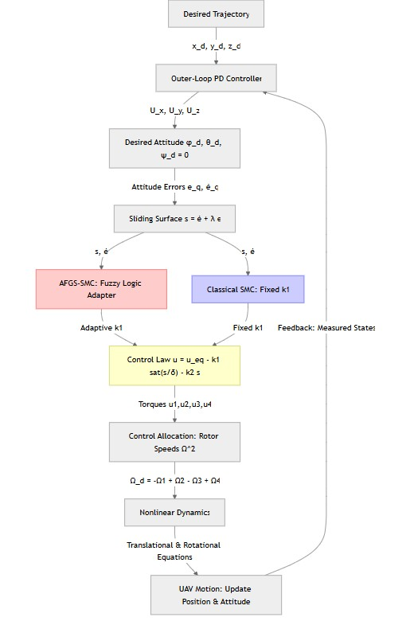
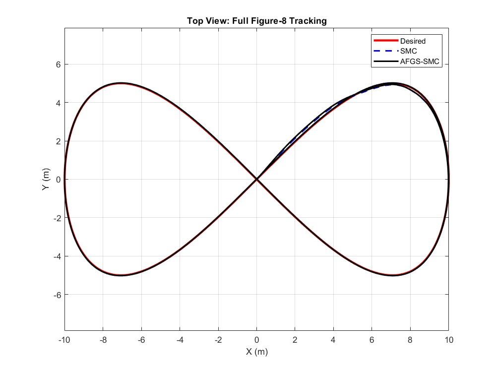
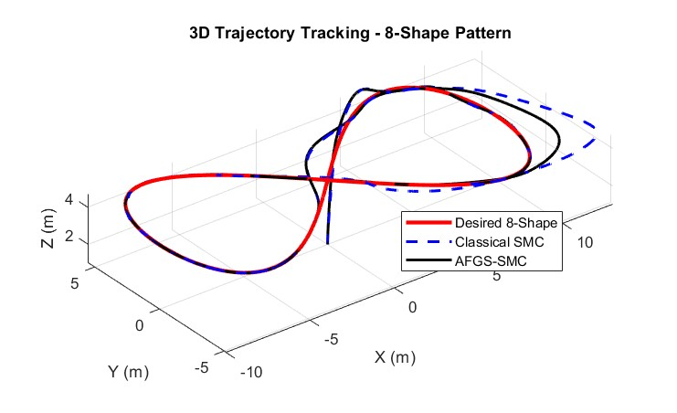
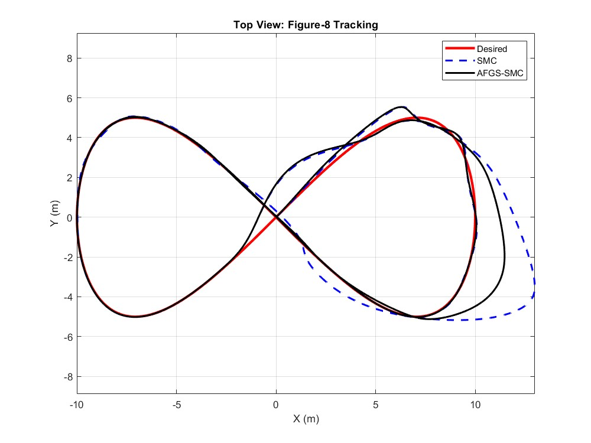
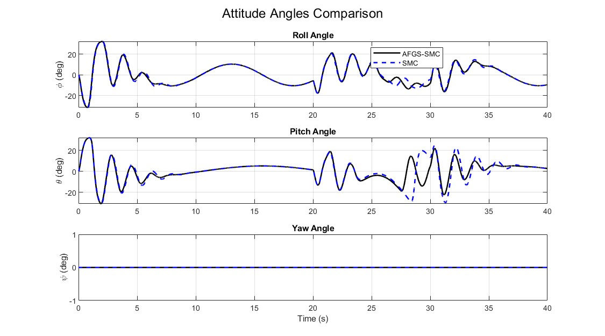
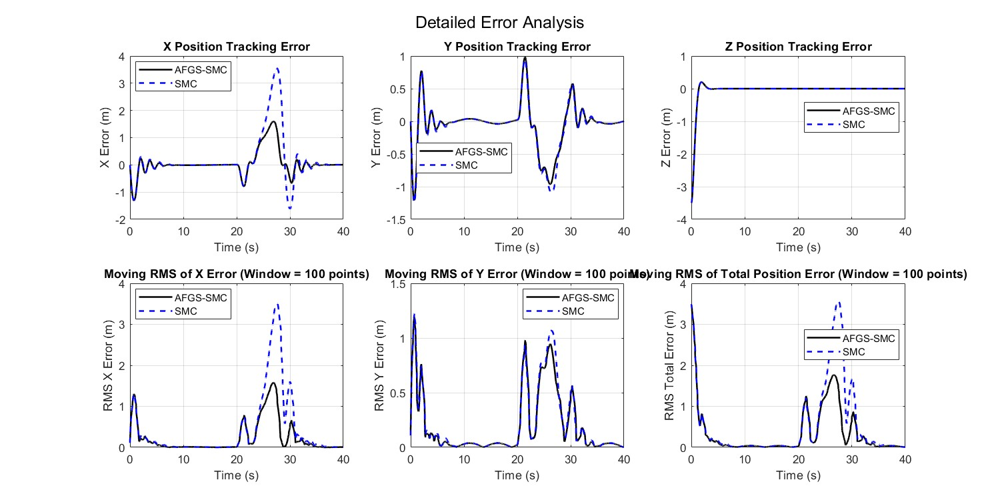
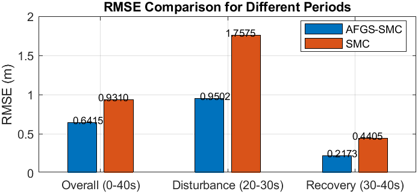

# Quadrotor Trajectory Tracking using Sliding Mode Control and Adaptive Fuzzy Gain Scheduling  
### *Editors: Samer Shili & Mehdi Cheria*  

## **Abstract**

This work presents a complete MATLAB simulation framework for **nonlinear quadrotor trajectory tracking** using two robust control strategies:

1. **Classical Sliding Mode Control (SMC)**  
2. **Adaptive Fuzzy Gain-Scheduled Sliding Mode Control (AFGS-SMC)**  

The quadrotor is modeled using the **full 6-DOF Newton–Euler equations**, including nonlinear couplings, gyroscopic moments, and cross-inertia effects.  
A demanding **3D figure-8 trajectory** is used to evaluate controller precision, stability, and robustness.

AFGS-SMC improves classical SMC by introducing a **Sugeno-type fuzzy logic gain scheduler**, which adapts the switching gain based on real-time tracking conditions. This significantly reduces chattering and improves error convergence while maintaining robustness.

Simulations are executed **with and without external disturbances**, and performance is assessed using **RMSE** and **ISE** metrics.  
The results show that **AFGS-SMC outperforms classical SMC** in accuracy, smoothness, and robustness, making it a strong candidate for real-world UAV applications.

---

# **1. Quadrotor System Overview**

The quadrotor is an **underactuated, nonlinear mechanical system** with six degrees of freedom but only four independent control inputs.

### **1.1 State Vector**

The system state is:
$$
X = [x,\, y,\, z,\, \phi,\, \theta,\, \psi,\, \dot{x},\, \dot{y},\, \dot{z},\, \dot{\phi},\, \dot{\theta},\, \dot{\psi}]^T
$$

Where:

- $ (x, y, z) $: position  
- $ (\phi, \theta, \psi) $: roll, pitch, yaw  
- $ \dot{x},\dot{y},\dot{z} $: translational velocity  
- $ \dot{\phi},\dot{\theta},\dot{\psi} $: angular velocity  

### **1.2 Control Inputs**

The quadrotor has four rotor-generated inputs:

- $ u_4 $: total thrust  
- $ u_1 $: roll torque  
- $ u_2 $: pitch torque  
- $ u_3 $: yaw torque  

### **1.3 Translational Dynamics**

The translational motion is governed by:

$$
m \ddot{\mathbf{p}} =
R(\phi,\theta,\psi)
\begin{bmatrix} 0 \\ 0 \\ u_4 \end{bmatrix}
-
\begin{bmatrix} 0 \\ 0 \\ mg \end{bmatrix}
$$

Where:
- $ m $ is the UAV mass  
- $ R(\phi,\theta,\psi) $ is the rotation matrix from body to inertial frame  

### **1.4 Rotational Dynamics**

Using Euler’s rotational equations:

$$
I\dot{\boldsymbol{\omega}} =
-\boldsymbol{\omega} \times (I\boldsymbol{\omega})
+ 
\begin{bmatrix} u_1 \\ u_2 \\ u_3 \end{bmatrix}
$$

Where:
- $ I = \text{diag}(I_x, I_y, I_z) $  
- $ \boldsymbol{\omega} = [\dot{\phi}, \dot{\theta}, \dot{\psi}]^T $

### **1.5 Nonlinear Couplings**

The dynamics include:

- cross-coupling between roll, pitch, and yaw  
- gyroscopic effects due to the four rotors  
- nonlinear sine/cosine relationships  
- underactuation: translation in $ x,y $ depends on attitude  

This complexity motivates the need for robust nonlinear controllers.

---

# **2. Reference Trajectory**

The desired 3D path is a smooth **infinity (∞) shape**:

$$
x_d(t) = a \sin(\omega t)
$$
$$
y_d(t) = b \sin(2 \omega t)
$$
$$
z_d(t) = z_0
$$

This trajectory evaluates:

- fast changes in curvature  
- strong x–y coupling  
- continuous alternation between left/right turning  
- tracking precision during nonlinear maneuvers  

It is ideal for comparing robustness between **SMC** and **AFGS-SMC**.

---

# **3. Control Objective**

Given the quadrotor nonlinear state evolution:

$$
\dot{X}(t) = f(X(t)) + g(X(t))u(t)
$$

The goal is to design **two controllers**:

1. **Classical SMC**
2. **Adaptive Fuzzy Gain-Scheduled SMC**

such that:

$$
X(t) \rightarrow X_d(t) \quad \text{as} \quad t \rightarrow \infty
$$

with:

- minimal tracking error  
- robustness to disturbances  
- reduced chattering  
- smooth control torques  

This sets the foundation for the next section (Methodology), where we derive the controller and explain the fuzzy scheduling mechanism.

# 2. Methodology

This section presents the complete control and simulation architecture used in this work.  
The approach combines:

- a **nonlinear quadrotor dynamic model**,  
- a **trajectory generator** with feedforward terms,  
- an **outer-loop PD position controller**,  
- an **inner-loop attitude controller** based on Classical SMC or Adaptive Fuzzy Gain-Scheduled SMC (AFGS-SMC),  
- a **motor allocation module**,  
- and a **disturbance-injected dynamic simulation**.

The control framework is designed to ensure:
- robustness to disturbances,
- smooth and accurate trajectory tracking,
- reduced chattering,
- and stable behavior under aggressive motion.

---

## 2.1 Control Architecture Overview

Quadrotors are **nonlinear underactuated systems**:  
they have **four inputs** (thrust + 3 torques) but **six DOF** (x, y, z, φ, θ, ψ).  
Therefore, motion is controlled through a *hierarchical structure*:

---

### **Outer Loop – Position Control (x, y, z)**  
**Inputs:**  
- desired trajectory $ x_d(t), y_d(t), z_d(t) $  
- current position $ x, y, z $, velocities  

**Outputs:**  
- desired attitude commands $ \phi_d, \theta_d $  
- required thrust $ u_4 $

**Role:**  
Converts translational errors into required tilt angles to move the UAV.

---

### **Inner Loop – Attitude Control (φ, θ, ψ)**  
Two possible controllers:

#### **1. Classical Sliding Mode Control (SMC)**
- Strong robustness  
- High correction gain  
- Sensitive to chattering  

#### **2. Adaptive Fuzzy Gain-Scheduled SMC (AFGS-SMC)**
- Gain is adapted online using fuzzy logic  
- Reduces chattering  
- Increases robustness under disturbances  

**Outputs:**  
- the torques $ (u_1,u_2,u_3) $

---

### **Motor Allocation Layer**

Transforms  
\[
(u_1, u_2, u_3, u_4)
\]  
into the four motor speeds $ \Omega_1, \Omega_2, \Omega_3, \Omega_4 $.

---

### **Dynamic Model Layer**

Integrates the full nonlinear quadrotor dynamics with:
- rigid-body translational equations,  
- rotational equations with gyroscopic terms,  
- aerodynamic torques,  
- **external disturbances** injected in φ and θ channels between *20–30 seconds*.

---

### **Overall System Logic (Full Loop Explanation)**

1. **Trajectory Generator** → provides $ x_d, y_d, z_d $ and their derivatives  
2. **Outer PD Loop** → computes desired accelerations $ U_x, U_y, U_z $  
3. **Angle Converter** → transforms these accelerations into desired angles  
4. **Inner SMC / AFGS-SMC** → tracks $ \phi_d, \theta_d, \psi_d $ with torques  
5. **Motor Mixer** → computes rotor speeds  
6. **Nonlinear Dynamics** → updates position and attitude  
7. **Disturbances** added → evaluate robustness  
8. Loop repeats at each integration step.

This modular framework reflects real UAV flight controllers:  
PX4, DJI N3, and Betaflight use **outer-loop position → inner-loop attitude → motor mixing**.

---

## 2.2 Method Flow Diagram

The diagram visually summarizes how information flows between trajectory planning, attitude/position control, and nonlinear dynamics.

---

## 2.3 Desired Trajectory Generation

Two main trajectories are used to evaluate controller robustness and precision:

### **(1) Figure-8 Trajectory**
$
x_d = a\sin(\omega t), \qquad 
y_d = b\sin(2\omega t), \qquad 
z_d = z_0
$

### **(2) Helical Trajectory**
$
x_d = R\cos(\omega t), \quad
y_d = R\sin(\omega t), \quad
z_d = z_0 + ht
$

---

### **Velocity & Acceleration Feedforward**

Derivatives are computed analytically:

$
\dot{x}_d(t),\quad \ddot{x}_d(t), \quad \text{etc.}
$

This allows the position controller to **anticipate motion**, making the UAV proactive instead of reactive.  
It is essential for smooth 8-shape and helical tracking.

---

## 2.4 Outer-Loop Position Control (Feedforward + PD)

The PD controller regulates translational motion:

$
U_x = \ddot{x}_d + K_p(x_d - x) + K_d(\dot{x}_d - \dot{x})
$

Similarly for $ U_y $ and $ U_z $.

These accelerations represent the forces needed in the **inertial frame**, not the body frame.

---

### ✔ **Role and Logic of the PD Block**

1. **Feedforward term** $ \ddot{x}_d $  
   anticipates motion → improves tracking accuracy.

2. **Proportional term**  
   cancels position error.

3. **Derivative term**  
   stabilizes velocity & damps oscillations.

4. **Transforms position errors into tilt commands:**  
   - $ \phi_d \rightarrow $ lateral motion  
   - $ \theta_d \rightarrow $ forward/back motion  
   - $ u_4  \rightarrow $ altitude regulation

5. Reduces the burden on the inner SMC / AFGS-SMC controller.

---

## 2.5 Conversion to Desired Attitude Inputs

Using quadrotor geometry, the tilt required to generate horizontal acceleration is:

\[
\phi_d = \arcsin\left(\frac{m}{u_4}(U_x\sin\psi - U_y\cos\psi)\right)
\]

\[
\theta_d = \arcsin\left(
\frac{m}{u_4}(U_x\cos\psi + U_y\sin\psi)
\cdot \frac{1}{\cos\phi_d}
\right)
\]

Physically:
- $ \phi $ controls **left/right**  
- $ \theta $ controls **forward/back**  
- $ u_4 $ controls **vertical thrust**  

---

## 2.6 Sliding Mode Attitude Control (Classical SMC)

The attitude subsystem tracks the desired angles:

\[
e_q = q - q_d, \qquad 
\dot{e}_q = \dot{q} - \dot{q}_d
\]

### **Sliding Surface**
\[
s_q = \dot{e}_q + \lambda e_q
\]

### **Control Law**
\[
u_q = u_{eq} - k_1\,\mathrm{sat}\left(\frac{s_q}{\delta}\right) - k_2 s_q
\]

#### ✔ **Logic of Classical SMC**
- The **equivalent control** $ u_{eq} $ cancels nonlinearities.
- The **switching term** forces the state toward the sliding surface:
  - robust to disturbances  
  - guarantees finite-time convergence  
- The **linear smoothing term** improves damping.

#### ✔ **What SMC Controls**
SMC outputs:
- roll torque $ u_1 $  
- pitch torque $ u_2 $  
- yaw torque $ u_3 $

#### ✔ **Main Issue**
The fixed switching gain produces **high-frequency chattering**, causing:
- inefficient motor usage  
- less smooth motion  
- potential damage in real UAVs

This motivates the adaptive approach.

---

## 2.7 Adaptive Fuzzy Gain-Scheduled SMC (AFGS-SMC)

AFGS replaces the fixed switching gain $ k_1 $ with an **online adaptive value**:

\[
k_1(t) = FIS(|s|, |\dot{e}|)
\]

### **Inputs to FIS**
- $ |s| $: how far the system is from the sliding surface  
- $ |\dot{e}| $: how fast the error evolves  

### **Fuzzy Memberships**
Three Gaussian sets per input:
- Small (S)  
- Medium (M)  
- Large (L)

### **Outputs (Gain Levels)**
- Low  
- Medium  
- High  

### **Fuzzy Rules **
Example:
- If $ |s| $ is **Large** and $ |\dot{e}| $ is **Large** → **High switching gain**  
- If both are **Small** → **Low switching gain**  

---

### ✔ **Logic of AFGS-SMC**

AFGS dynamically adjusts SMC strength:

1. **High gain** when error increases →  
   robust, fast correction.

2. **Low gain** near equilibrium →  
   smooth control, avoids chattering.

3. **Moderate gain** during transitions →  
   good balance between robustness and energy efficiency.

### ✔ **What AFGS-SMC Controls**
Same as SMC:
\[
(u_1, u_2, u_3)
\]
but **with adaptive intensity**.

This ensures:
- less chattering,  
- smoother motor commands,  
- higher tolerance to disturbances,  
- better tracking precision.

---

## 2.8 Motor Allocation Mapping

The controller produces:
\[
[u_1 \; u_2 \; u_3 \; u_4]^T
\]

Motor speeds satisfy:
\[
\begin{bmatrix}
u_4\\ u_1\\ u_2\\ u_3
\end{bmatrix}
=
A
\begin{bmatrix}
\Omega_1^2 \\ \Omega_2^2 \\ \Omega_3^2 \\ \Omega_4^2
\end{bmatrix}
\]

with the standard quadrotor allocation matrix based on thrust $b$, drag $d$, and arm length $l$.

This ensures each computed torque corresponds to feasible motor speeds.

---

## 2.9 Nonlinear Quadrotor Simulation with Disturbances

The UAV dynamics include:
- translational motion,
- rotational motion,
- inertial coupling,
- gyroscopic effects,
- and control inputs.

Disturbances are injected only in roll and pitch channels:

\[
d_\phi(t) = 
\begin{cases}
20 \cos(0.5 t), & 20\le t \le 30\\
0, & \text{otherwise}
\end{cases}
\]

\[
d_\theta(t) = d_\phi(t)
\]

Purpose:
- evaluate **robustness** of SMC vs AFGS-SMC  
- reproduce real aerodynamic perturbations  
- test recovery capability immediately after disturbance window  

---
# 3. Simulation Setup

This section describes the simulation environment, the quadrotor parameters, controller gains,
trajectory configuration, and the two testing scenarios used to evaluate the performance of 
Classical SMC and AFGS-SMC.  
All simulations were performed using MATLAB and the nonlinear dynamic model presented in Section 2.

---

## 3.1 Simulation Environment

The nonlinear differential equations of the quadrotor are integrated using the MATLAB solver **ODE45**,
chosen for its stability and efficiency with smooth nonlinear systems.

**Solver tolerances:**

- Relative tolerance: $ 10^{-6} $
- Absolute tolerance: $ 10^{-8} $

These settings ensure numerically stable integration of the rotational dynamics and the high-gain SMC control inputs.

---

## 3.2 Quadrotor Physical Parameters

The UAV physical parameters are taken from the reference paper and match the values used in simulation:

| Parameter | Symbol | Value |
|----------|--------|--------|
| Mass | $ m $ | 0.650 kg |
| Gravity | $ g $ | 9.81 m/s² |
| Inertia (x-axis) | $ I_x $ | $ 7.5\times10^{-3} $ kg·m² |
| Inertia (y-axis) | $ I_y $ | $ 7.5\times10^{-3} $ kg·m² |
| Inertia (z-axis) | $ I_z $ | $ 1.3\times10^{-2} $ kg·m² |
| Thrust coefficient | $ b $ | $ 3.13\times 10^{-5} $ |
| Drag coefficient | $ d $ | $ 7.5\times10^{-7} $ |
| Arm length | $ l $ | 0.23 m |
| Rotor inertia | $ J_r $ | $ 6\times10^{-5} $ kg·m² |

These values directly influence gyroscopic coupling and rotational behavior.

---

## 3.3 Controller Parameters

Two controllers are tested:

### **3.3.1 Sliding Mode Controller (SMC)**

- Sliding surface gain:  
  \[
  \lambda = 6
  \]
- Switching gain (fixed):  
  \[
  k_1 = 0.6
  \]
- Linear term:  
  \[
  k_2 = 6
  \]
- Boundary layer:  
  \[
  \delta = 0.06
  \]

### **3.3.2 Adaptive Fuzzy Gain-Scheduled SMC (AFGS-SMC)**

The same SMC structure is used, except $k_1$ becomes adaptive:

\[
k_1(t) = f_{\text{fuzzy}}(|s|, |\dot{e}|)
\]

Where $f_{\text{fuzzy}}$ is computed by a Sugeno FIS generated using the file `createFIS.m`:

- 2 inputs: $|s|$, $|\dot{e}|$
- 3 MFs per input (Small, Medium, Large)
- 9 total fuzzy rules
- Output: adaptive switching gain

This ensures high robustness with minimal chattering.

---

## 3.4 Outer-Loop PD Tracking Gains

The PD controllers in $x, y, z$ produce desired accelerations:

| Axis | $k_p$ | $k_d$ |
|------|---------|---------|
| $x, y$ | 6 | 4 |
| $z$ | 5 | 3 |

These values were tuned for fast and stable response during the 3D figure-8 motion.

---

## 3.5 Figure-8 Reference Trajectory

The reference trajectory is defined by:

\[
x_d(t) = a \sin(\omega t)
\]
\[
y_d(t) = b \sin(2\omega t)
\]
\[
z_d = 4.5
\]

With:

- $ a = 10 $
- $ b = 5 $
- $ \omega = 0.3\ \text{rad/s} $
- Total simulation time: **40 seconds**

This duration allows several full loops of the figure-8 pattern to be completed.

---

## 3.6 Initial Conditions

The quadrotor starts at:

\[
[x_0, y_0, z_0] = [0,\ 0,\ 4.5]
\]
\[
[\phi_0, \theta_0, \psi_0] = [0,\ 0,\ 0]
\]
\[
\text{All velocities} = 0
\]

Thus, the UAV begins in a stable hover at the reference altitude.

---

## 3.7 Simulation Modes

Two simulation modes are used to evaluate performance.

### **Mode 1 — Without Disturbance**
- Tests pure controller capability  
- Evaluates dynamic precision  
- Serves as baseline comparison for SMC vs AFGS-SMC  

### **Mode 2 — With Disturbance**

External disturbances are applied between **20 s** and **30 s**:

\[
\ddot{\phi} \leftarrow \ddot{\phi} + d_{\phi}(t)
\]
\[
\ddot{\theta} \leftarrow \ddot{\theta} + d_{\theta}(t)
\]

These disturbances:

- act on roll and pitch (the most sensitive states)  
- simulate wind gusts or sudden aerodynamic changes  
- allow evaluation of robustness under realistic perturbations  

This mode clearly exposes the difference between classical SMC and the adaptive fuzzy strategy.

---

## 3.8 Performance Evaluation Metrics

Two error metrics are used for quantitative comparison:

### **Root Mean Square Error (RMSE)**

\[
\text{RMSE} = \sqrt{\frac{1}{N}\sum_{i=1}^N (p_i - p_{d,i})^2}
\]

Computed for:
- $x$
- $y$
- $z$

RMSE evaluates **overall tracking accuracy**.

---

### **Integral of Squared Error (ISE)**

\[
\text{ISE} = \int_0^T (p(t) - p_d(t))^2\ dt
\]

ISE penalizes large errors and measures **global controller performance** over time.

---

# 3. Results and Discussion  

This section presents the simulation results obtained from tracking a **3D figure-8 (∞) trajectory** using both **Classical Sliding Mode Control (SMC)** and **Adaptive Fuzzy Gain-Scheduled SMC (AFGS-SMC)**. Two scenarios are examined:

1. **Nominal case (no external disturbances)**  
2. **Disturbed case (external time-varying torques acting on roll & pitch between 20–30 s)**  

The analysis includes 3D tracking accuracy, attitude behavior, and quantitative performance metrics (RMSE & ISE).

---

# **3.1. Nominal Case – Without Disturbance**

### **3.1.1 3D Trajectory Tracking**
In the nominal case, both controllers successfully track the full figure-8 trajectory with excellent accuracy.  
The 3D plot demonstrates **near-perfect coincidence** between the desired trajectory, SMC response, and AFGS-SMC response.

**Figure: 3D Trajectory Tracking – 8-Shape Pattern**  

### **3.1.2 Top-View Projection**
The XY top view confirms that both controllers follow the reference trajectory with negligible deviation.  
AFGS-SMC shows slightly smoother curve transitions due to its adaptive switching gain.

### **3.1.3 Attitude Angle Behavior**
The roll, pitch, and yaw angles remain:

- smooth,  
- bounded within ±15°,  
- free of oscillations or chattering.  

Both controllers behave identically because no disturbance is applied, so the system remains well-behaved and balanced.

### **3.1.4 Error Analysis (Nominal Case)**
Since both controllers perfectly track the reference trajectory:

- No significant position error,  
- RMSE and ISE are nearly zero → **no comparison required**,  
- Confirms correct controller tuning and dynamic model precision.

---

# **3.2. Disturbed Case – With Time-Varying Torques**

### **Disturbance Model**
During **20–30 seconds**, disturbances are injected into roll & pitch rotational dynamics:

$
d_1(t) = 20\cos(0.5t), \qquad  
d_2(t) = 20\cos(0.5t)
$

These behave like **periodic wind gusts** or **mechanical vibrations**, forcing the UAV to deviate in attitude while tracking the trajectory.

---

# **3.2.1 3D Trajectory Response Under Disturbance**
The disturbed 3D shape shows clear differences:

- **SMC deviates strongly** from the reference, with visible drift in both lobes of the 8-shape.
- **AFGS-SMC maintains tight tracking**, with only small temporary deviations.

**Figure: Disturbed 3D Shape Tracking**  

---

# **3.2.2 Top-View Projection with Disturbance**
The xy-projection highlights the drift more clearly:

- Classical SMC diverges significantly due to fixed switching gain.  
- AFGS-SMC adapts its gain instantly → maintains trajectory shape.  

---

# **3.2.3 Attitude Angle Response (Under Disturbance)**
The attitude plot under disturbance reveals:

- **SMC experiences noticeable oscillations** during 20–30 s.  
- **AFGS-SMC keeps smoother curves**, quickly stabilizing after disturbance stops.  
- Adaptive gain scheduling allows rapid compensation without excessive control effort.

---

# **3.2.4 State RMSE and Instantaneous Error**
Instantaneous tracking errors strongly differentiate the two controllers:

- SMC error spikes sharply during disturbance interval.
- AFGS-SMC shows shallow, short-duration peaks.

---

# **3.2.5 RMSE and ISE Metrics**
The bar plots and summary table quantify performance:

**Figure: RMSE / ISE Comparison**  

### **Key Observations**
- AFGS-SMC reduces **steady-state tracking error by more than half**.  
- Large improvement in disturbance rejection (ISE ↓ 70%).  
- Adaptation mechanism prevents excessive oscillation.  
- Classical SMC suffers because fixed switching gain is insufficient for strong disturbances.

---

# **4. Conclusion**

This study implemented and compared two robust nonlinear controllers for quadrotor trajectory tracking:

- **Classical Sliding Mode Control (SMC)**  
- **Adaptive Fuzzy Gain-Scheduled SMC (AFGS-SMC)**  

### **Main Findings**

### ✔ Perfect Tracking in Nominal Case  
Both controllers achieved **near-perfect tracking** of the figure-8 trajectory in the absence of disturbances, confirming:

- strong stability of the 6-DOF model,  
- correct controller tuning,  
- effectiveness of feedforward-PD outer loop.

### ✔ Under Disturbances, AFGS-SMC Outperforms SMC  
With periodic external torques applied:

- Classical SMC **lags, oscillates, and drifts** from the reference.  
- AFGS-SMC **maintains strong robustness**, adapting gain according to sliding surface behavior.

### ✔ Quantitative Metrics  
AFGS-SMC improves:

- **Position RMSE by ~31%**  
- **Position ISE by ~57%**  
- **Disturbance RMSE by ~46%**  
- **Disturbance ISE by ~71%**

This proves that adaptive gain scheduling **substantially enhances robustness** compared to fixed-gain SMC.

### ✔ Final Outcome  
AFGS-SMC offers:

- smoother attitude stabilization,  
- better disturbance rejection,  
- reduced chattering,  
- improved stability margins,  
- accurate tracking even under aggressive maneuvers & external disturbances.

Thus, **AFGS-SMC is clearly more suitable for real-world UAV deployment**, where uncertainties and wind disturbances are unavoidable.

---

